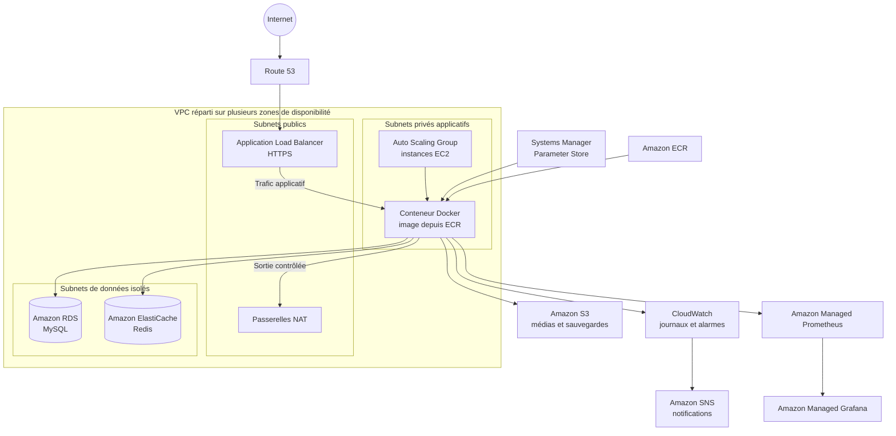

# Infrastructure AWS modulaire avec Terraform

<p>
    
    
    
    
    
    
    
    
</p>

Infrastructure as Code pour déployer une plateforme applicative conteneurisée sur AWS. Le dépôt met l'accent sur la séparation des environnements, la sécurité réseau, la disponibilité et l'observabilité, tout en permettant d'adapter les coûts selon le contexte.

## Objectifs

- Décrire l'infrastructure AWS de façon reproductible et versionnable avec Terraform.
- Réutiliser des modules dédiés plutôt que dupliquer les ressources dans chaque environnement.
- Séparer les environnements `dev`, `staging` et `prod`, avec des paramètres de résilience et de coût adaptés.
- Exécuter une application Docker sur des instances EC2 privées, derrière un répartiteur de charge et un groupe Auto Scaling.
- Centraliser les métriques, les journaux et les alertes pour faciliter l'exploitation.

## Architecture



Le VPC sépare les ressources en trois niveaux : les subnets publics accueillent l'ALB et les passerelles NAT, les subnets privés hébergent les instances applicatives, et les subnets de données hébergent RDS et ElastiCache sans route vers Internet. Les groupes de sécurité limitent les flux entre ces niveaux.

## Composants

| Domaine | Modules / services | Rôle |
|---|---|---|
| Réseau | `vpc`, `security-groups` | VPC multi-AZ, subnets par niveau, routage, NAT, Flow Logs et filtrage des flux. |
| Entrée et DNS | `alb`, `route53` | Répartition du trafic HTTP/HTTPS et enregistrement DNS. |
| Calcul | `ec2`, `autoscaling` | Launch Template, instances privées, remplacement des instances défaillantes et adaptation à la charge CPU. |
| Images et configuration | `ecr`, `app-config` | Registre des images Docker et version applicative sélectionnée via Systems Manager Parameter Store. |
| Données | `rds`, `elasticache`, `s3` | MySQL, Redis et buckets distincts pour les médias et les sauvegardes. |
| Identités | `iam` | Rôles et permissions des instances pour accéder aux services nécessaires. |
| Observabilité | `cloudwatch`, `observability`, `sns` | Journaux et alarmes CloudWatch, métriques Prometheus, Grafana managé et notifications. |

Les instances récupèrent au démarrage la version applicative dans Parameter Store, s'authentifient auprès d'ECR et lancent le conteneur avec systemd. La construction et la publication de l'image applicative ne sont pas définies dans ce dépôt.

## Environnements

Chaque environnement possède son propre dossier sous `environments/` et compose les modules partagés avec ses variables et paramètres de résilience.

| Environnement | Configuration notable |
|---|---|
| `dev` | Une passerelle NAT partagée, RDS sans Multi-AZ, protection contre la suppression désactivée et un nœud Redis : configuration orientée maîtrise des coûts. Le module DNS est actuellement commenté. |
| `staging` | Configuration de préproduction avec enregistrement DNS dans une zone existante. Les paramètres de disponibilité des données restent proches de ceux de `dev`. |
| `prod` | Une passerelle NAT par AZ, RDS Multi-AZ avec protection contre la suppression et snapshot final, ainsi qu'ElastiCache avec réplicas et bascule automatique. La zone DNS y est créée. |

Les valeurs exactes, tailles d'instances et nombres de zones sont configurables. Les coûts AWS dépendent notamment du nombre de passerelles NAT, des instances, du stockage et du trafic.

## Pratiques d'ingénierie

- **Modules réutilisables et contrats explicites** : chaque module expose ses entrées et sorties, ce qui sépare les responsabilités et rend les dépendances entre couches lisibles.
- **Réseau en profondeur** : les bases de données n'ont pas de route Internet ; leurs groupes de sécurité n'acceptent les connexions que depuis le groupe applicatif. L'application n'accepte son trafic qu'en provenance de l'ALB.
- **Identité et moindre privilège** : les instances utilisent un profil IAM ; les politiques IAM et les accès réseau sont limités aux services ou sources nécessaires.
- **Durcissement des instances** : IMDSv2 est obligatoire, le volume racine EBS est chiffré et la surveillance détaillée des instances est activée.
- **Gestion des secrets** : le mot de passe maître RDS est généré par Terraform et enregistré dans Secrets Manager plutôt que fourni en clair dans les variables d'environnement.
- **Protection des données** : RDS n'est pas accessible publiquement ; le chiffrement est activé pour RDS et S3, et S3 bloque l'accès public. Le module S3 prévoit également versionnement et règles de cycle de vie configurables.
- **Résilience applicative** : l'Auto Scaling Group répartit les instances dans les subnets privés, s'appuie sur les vérifications de santé de l'ELB et déploie les nouvelles versions avec un rafraîchissement progressif et rollback configurable.
- **Résilience adaptée à l'environnement** : le nombre de NAT, le Multi-AZ, les snapshots et les réplicas Redis varient selon les besoins de disponibilité et de budget.
- **Observabilité intégrée** : CloudWatch collecte les journaux et surveille les métriques de l'ALB, de l'ASG, de RDS et de Redis ; node_exporter et le collecteur OpenTelemetry envoient les métriques vers Managed Prometheus ; les alarmes peuvent notifier via SNS.
- **Traçabilité et maintenance de l'état** : les ressources sont étiquetées par projet et environnement ; les blocs `moved` préservent l'adresse d'une ressource lors d'un refactoring Terraform.
- **Versions déclarées** : la configuration exige Terraform `>= 1.5.0` et contraint les versions des providers AWS, Random et Grafana.

## Structure du dépôt

```text
environments/
  dev/                 Configuration de développement
  staging/             Configuration de préproduction
  prod/                Configuration de production
modules/
  alb/                 Répartiteur de charge
  app-config/          Paramètres de l'application
  autoscaling/         Groupe et stratégie de mise à l'échelle
  cloudwatch/          Journaux et alarmes
  ec2/                 Launch Template et instances
  ecr/                 Registre de conteneurs
  elasticache/         Cache Redis
  iam/                 Rôles et politiques IAM
  observability/       Prometheus et Grafana managés
  rds/                 Base de données MySQL
  route53/             DNS
  s3/                  Buckets de stockage
  security-groups/     Règles réseau
  sns/                 Notifications
  vpc/                 Réseau et subnets
```

## Prérequis

- Terraform `>= 1.5.0`.
- Un compte AWS et des identifiants configurés avec les permissions nécessaires pour créer les ressources des modules.
- Un certificat ACM valide et un nom de domaine si l'accès HTTPS/DNS est activé.
- Pour `prod`, le backend S3 et la table DynamoDB référencés dans `environments/prod/backend.tf` doivent être disponibles avant l'initialisation. Vérifier et adapter cette configuration à son propre compte AWS.
- Une image applicative disponible dans ECR et un paramètre Systems Manager contenant son tag pour démarrer l'application.

## Déploiement

Depuis le dossier de l'environnement ciblé, par exemple `environments/dev` :

1. Copier `terraform.tfvars.example` vers `terraform.tfvars`, puis renseigner les valeurs adaptées, notamment le nom du domaine, l'ARN du certificat ACM et les adresses d'alerte.
2. Initialiser Terraform :

   ```bash
   terraform init
   ```

3. Formater et vérifier la configuration :

   ```bash
   terraform fmt -check -recursive
   terraform validate
   ```

4. Examiner le plan puis appliquer explicitement les changements :

   ```bash
   terraform plan -out=tfplan
   terraform apply tfplan
   ```

Pour `staging` ou `prod`, lancer les mêmes commandes depuis le dossier correspondant et utiliser les valeurs propres à cet environnement. Examiner chaque plan avant son application.

## Sécurité et gestion de l'état

Ne pas versionner `terraform.tfvars`, les fichiers d'état Terraform, les plans sauvegardés ou des identifiants AWS. L'état peut contenir des valeurs sensibles même lorsque celles-ci sont également stockées dans Secrets Manager. Pour un usage partagé, utiliser un backend distant chiffré avec verrouillage, restreindre son accès IAM et activer la gestion sécurisée de son historique. Le backend de production est déclaré dans `environments/prod/backend.tf` ; les environnements qui ne déclarent pas de backend distant utilisent l'état local par défaut.

## Périmètre

Ce dépôt décrit l'infrastructure cloud. Il ne contient ni le code source de l'application, ni la construction de son image Docker, ni un pipeline CI/CD. Ces éléments doivent être fournis séparément ; la plateforme attend que l'image soit publiée dans ECR et que la version à déployer soit renseignée dans Parameter Store.